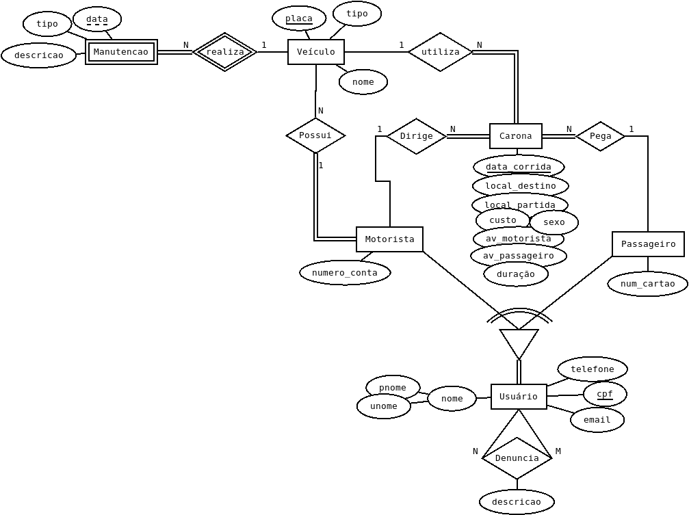

# Banco Dados Carona

## Objetivos
- [ ] Identificação
- [ ] Descrição
- [ ] Relação de perfis de usuários 
- [ ] Consultas em linguagem natural
- [x] Diagrama entidade-relacionamento
- [x] Modelo relacional
- [x] Implementação SQL
- [ ] Criar exemplos das tabelas
- [ ] Consultas em SQL
- [x] Bibliografia
