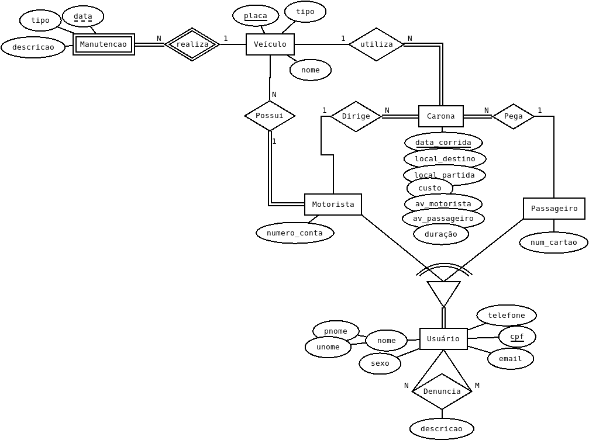

# Banco Dados Carona

## Objetivos
- [x] Identificação
- [x] Descrição
- [x] Relação de perfis de usuários 
- [x] Consultas em linguagem natural
- [x] Diagrama entidade-relacionamento
- [x] Modelo relacional
- [x] Implementação SQL
- [ ] Criar exemplos das tabelas
- [ ] Consultas em SQL
- [x] Bibliografia
